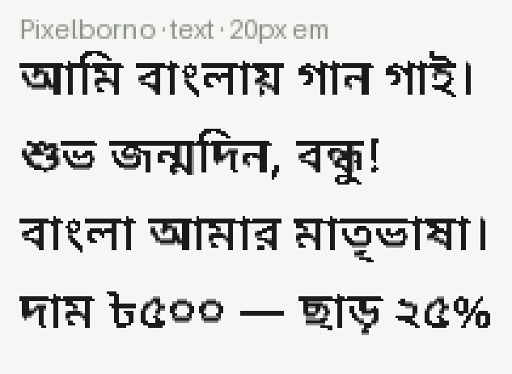
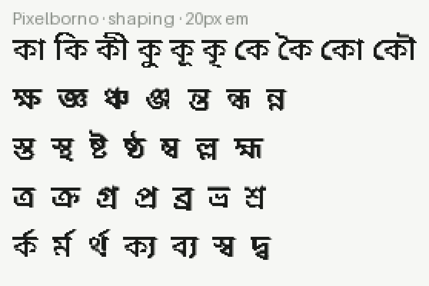
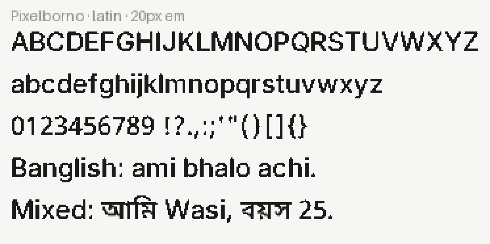
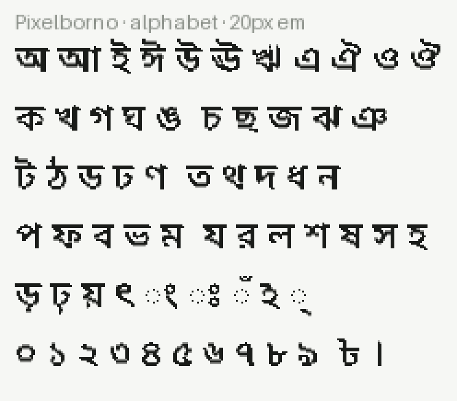

# Pixelborno · পিক্সেলবর্ণ

A pixel font that can actually write Bengali — conjuncts, vowel signs, reph and
all — plus Latin on the same grid, under the SIL Open Font License.



## Why

Pixel fonts for Bengali barely exist, and the ones that do are freeware with no
redistribution grant, so nothing that ships can use them. Drawing one is not a
matter of drawing fifty letters either. Bengali fuses consonants into hundreds
of conjuncts (ক + ষ becomes ক্ষ, not ক্‌ষ), hangs vowel signs on all four sides
of a cluster, and lifts র to the top of the syllable it began. That knowledge
lives in a font's GSUB and GPOS tables and is a typographer's year of work.

So Pixelborno isn't drawn. It takes two fonts that already know all of it and
replaces every outline with its own silhouette on a 20-pixel grid:

| Part | Source | Licence |
|---|---|---|
| Bengali, digits, দাঁড়ি, punctuation | [Noto Sans Bengali](https://github.com/notofonts/bengali) | OFL-1.1 |
| Latin, ASCII and Latin-1 | [Inter](https://github.com/rsms/inter) | OFL-1.1 |

The shaping tables are Noto's, untouched. That's the whole trick: the result
renders ক্ষ and র্ক correctly and merely looks like it was built out of blocks.



Both halves are pixelated at the same grid, anchored at the font origin rather
than at each glyph's own bounding box, so a line that mixes Bengali and Banglish
sits on one lattice instead of two that nearly line up.



## Coverage

844 glyphs. The full Bengali block including every conjunct Noto ships, Bengali
and ASCII digits, ৳, দাঁড়ি, basic Latin, Latin-1 letters, and the typographic
quotes and dashes a keyboard's punctuation key produces.



## Using it

Grab `Pixelborno-Regular.ttf` from
[Releases](https://github.com/wasi-master/pixelborno/releases).

It is drawn on a **20-pixel em**, so it is pixel-crisp at 20 px, 40 px, 60 px and
so on. In between those it is resampled and reads as an ordinary blurry font —
if you control the size, use a multiple of 20.

```css
@font-face {
  font-family: "Pixelborno";
  src: url("Pixelborno-Regular.ttf") format("truetype");
}
.pixel { font-family: "Pixelborno"; font-size: 40px; }
```

## Building

```bash
pip install -r requirements.txt
python3 tools/build.py              # -> dist/Pixelborno-Regular.ttf
python3 tools/check.py              # coverage, grid, shaping, conjuncts
python3 tools/specimen.py           # -> specimens/*.png
```

Takes a couple of seconds. `dist/` isn't committed — CI attaches the font to
every tagged release, and `tools/build.py` reproduces it from `sources/`.

Both source fonts are vendored in `sources/`. The OFL exists to permit exactly
that, and a build that downloads its inputs stops reproducing the day an
upstream tag moves.

### Knobs

```bash
python3 tools/build.py --pixel 40 --weight 400 --out dist/Pixelborno-Fine.ttf
```

- **`--pixel`** (default 50) is the grid in font units. At 1000 units/em, 50
  gives the 20-pixel em. 40 (25 px/em) keeps more detail but stops looking
  deliberate; 84 (12 px/em) closes the counters of ঘ and ভ.
- **`--weight`** (default 500) is the weight taken off the source's variable
  axis before pixelating. At 20 px/em a 400-weight stem covers about 1.2 pixels,
  so it rounds to one pixel here and two there and the letters come out ragged.
  500 clears 1.5 nearly everywhere and lands on two. 600 goes one step too far
  and fills in the counters.

### How it works

`tools/pixelate_font.py` is the general part and works on any TrueType font:

1. Decompose every glyph, flatten its curves, and scan-convert it with non-zero
   winding at 16 samples per cell. A cell at least half covered turns on.
2. Merge the on-cells into non-overlapping rectangles — runs along a row, then
   grown downward while the row below matches — and emit those as the outline.
   A letter's stems and bars collapse into a handful of contours this way.
3. Snap advances, mark anchors and kerning to the same grid, so a vowel sign
   never lands half a pixel off the letter it belongs to.
4. Drop the hinting tables, which describe outlines that no longer exist.

The grid is anchored at the font origin throughout, which is what lets two
different fonts be pixelated separately and still agree on where pixels are.

## Licence

[SIL Open Font License 1.1](OFL.txt). Same as both sources. You can use it in
anything, including commercially; you can modify it; you cannot sell it on its
own.
